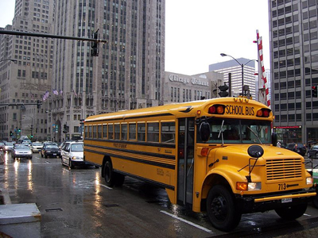
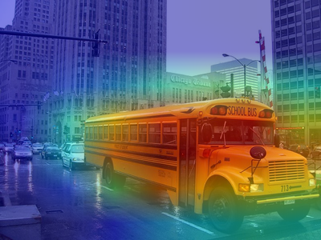
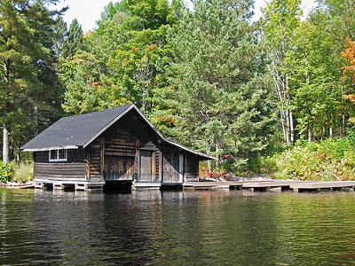
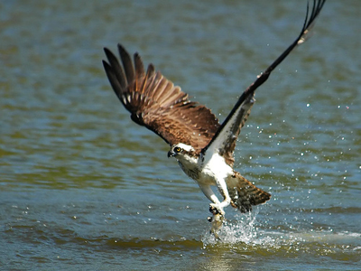
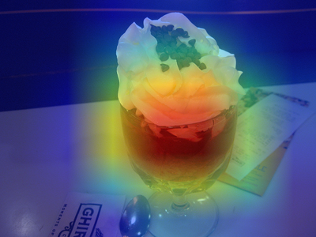

# Class Activation Map (CAM)

This work is based on Bolei Zhou's [paper](https://arxiv.org/abs/1512.04150) and metalbubble's [code](https://github.com/metalbubble/CAM/blob/master/pytorch_CAM.py).

